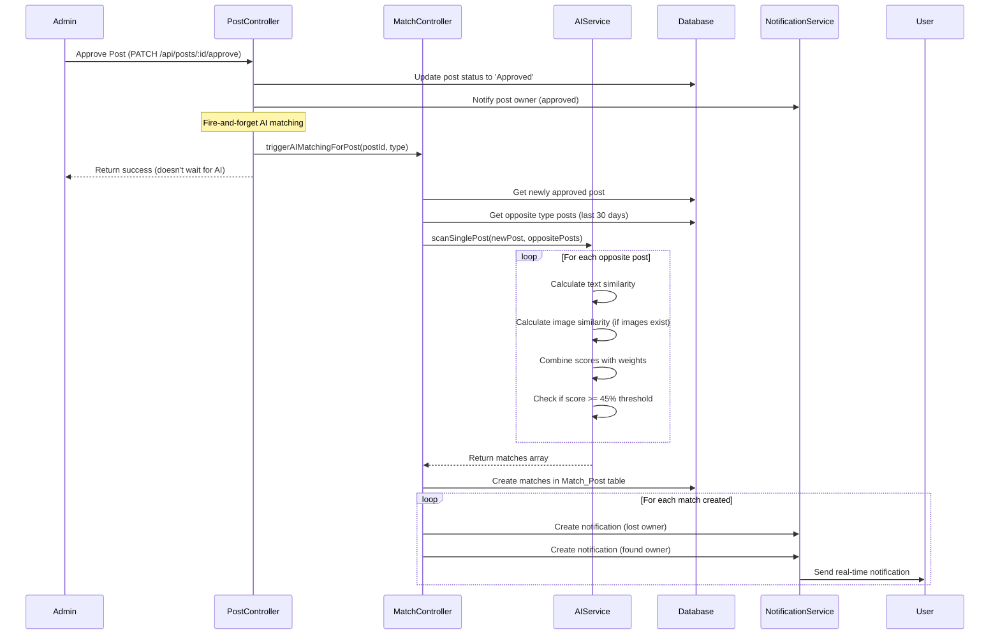

# AI Matching System Guide
## Lost & Found Platform

> [!IMPORTANT]
> This guide documents the **actual implementation** of the AI matching system based on source code analysis. The AI matching is **event-driven** and triggers immediately when an admin approves a post, NOT on a scheduled basis.

---

## Table of Contents
1. [Overview](#overview)
2. [How AI Matching Works](#how-ai-matching-works)
3. [Trigger Mechanism](#trigger-mechanism)
4. [Matching Algorithm](#matching-algorithm)
5. [Confidence Score System](#confidence-score-system)
6. [Technical Implementation](#technical-implementation)
7. [Testing & Debugging](#testing--debugging)

---

## Overview

The AI Matching System automatically finds potential matches between **Lost Posts** and **Found Posts** using:
- **Text Similarity Analysis** (Transformers.js with multilingual support)
- **Image Similarity Analysis** (CLIP model for visual comparison)
- **Keyword Boosting** (Exact keyword matching for better accuracy)

### Key Features
- ✅ **Event-Driven**: Triggers immediately when admin approves a post
- ✅ **Multilingual Support**: Uses `paraphrase-multilingual-mpnet-base-v2` model (supports Vietnamese)
- ✅ **Hybrid Scoring**: Combines text (60%) and image (40%) similarity
- ✅ **Smart Filtering**: Only matches posts from last 30 days
- ✅ **Real-time Notifications**: Sends notifications to both users when match is found

---

## How AI Matching Works

### Workflow Diagram



---

## Trigger Mechanism

### When Does AI Matching Trigger?

**AI matching triggers IMMEDIATELY when an admin approves a post.**

#### Source Code Evidence

**File**: `backend/src/modules/post/postController.js`

```javascript
export const approvePost = async (req, res, next) => {
  // ... approval logic ...
  
  // 🤖 Trigger AI matching (Event-driven, fire-and-forget)
  triggerAIMatchingForPost(id, type.toLowerCase()).catch(err => {
    console.error('❌ Background AI matching failed:', err);
    // Don't fail the approval if AI matching fails
  });

  res.status(200).json({
    success: true,
    message: 'Post approved successfully'
  });
};
```

### Fire-and-Forget Pattern

The AI matching runs **asynchronously** in the background:
1. Admin approves post → Response sent immediately ✅
2. AI matching runs in background (doesn't block response) 🔄
3. If AI matching fails, approval still succeeds ✅

---

## Matching Algorithm

### Step-by-Step Process

#### 1. **Get Opposite Type Posts**
When a new post is approved, the system retrieves all opposite type posts:
- New **Lost Post** → Get all **Found Posts** (last 30 days)
- New **Found Post** → Get all **Lost Posts** (last 30 days)

**Source**: `matchModel.getOppositeTypePosts(postType, postId)`

#### 2. **Text Similarity Calculation**

**Model**: `Xenova/paraphrase-multilingual-mpnet-base-v2`
- Supports Vietnamese and English
- 768-dimensional embeddings
- Semantic understanding (not just keyword matching)

**Text Components with Weights**:
```javascript
const TITLE_WEIGHT = 0.65;        // 65% - Most important
const ITEM_NAME_WEIGHT = 0.2;     // 20% - Second most important
const DESCRIPTION_WEIGHT = 0.1;   // 10% - Adds context
const LOCATION_WEIGHT = 0.025;    // 2.5% - Less important
const CATEGORY_WEIGHT = 0.025;    // 2.5% - Least important
```

**Process**:
1. Create weighted text from post (title repeated 6-7 times for importance)
2. Normalize text (lowercase, remove diacritics, special chars)
3. Generate embeddings using Transformers.js
4. Calculate cosine similarity between embeddings

#### 3. **Keyword Boosting**

To improve exact matches, the system boosts similarity when titles share keywords:

```javascript
// Extract keywords (length > 3 characters)
const keywords1 = extractKeywords(post1.Post_Title);
const keywords2 = extractKeywords(post2.Post_Title);
const commonKeywords = keywords1.filter(k => keywords2.includes(k));

// Boost similarity based on common keywords
if (commonKeywords.length >= 2) {
  textSimilarity = Math.max(textSimilarity, 0.85); // Strong boost to 85%
} else if (commonKeywords.length === 1) {
  textSimilarity = Math.max(textSimilarity, 0.70); // Moderate boost to 70%
}
```

**Example**:
- Post 1: "Mất ví da màu nâu"
- Post 2: "Nhặt được ví da"
- Common keywords: ["ví", "da"] → Boost to 85%

#### 4. **Image Similarity Calculation**

**Model**: CLIP (Contrastive Language-Image Pre-training)
- Only calculated if BOTH posts have images
- Compares visual features of images

**Process**:
1. Check if both posts have images
2. Use CLIP model to analyze image similarity
3. Return similarity score (0-1)

#### 5. **Final Score Calculation**

```javascript
const TEXT_WEIGHT = 0.6;   // 60% weight for text
const IMAGE_WEIGHT = 0.4;  // 40% weight for image

if (hasImages1 && hasImages2) {
  // Both have images: weighted average
  finalSimilarity = (textSimilarity * TEXT_WEIGHT) + (imageSimilarity * IMAGE_WEIGHT);
} else {
  // No images: use text similarity only
  finalSimilarity = textSimilarity;
}
```

#### 6. **Filtering & Validation**

**Minimum Thresholds**:
```javascript
const SIMILARITY_THRESHOLD = 0.45;      // 45% minimum to create match
const MIN_TEXT_SIMILARITY = 0.35;       // 35% text minimum (prevents image-only false positives)
```

**Additional Filters**:
- ✅ Only match `Lost` with `Found` (not same type)
- ✅ Don't match posts from same account
- ✅ Only match approved posts
- ✅ Only match posts from last 30 days
- ✅ Text similarity must be >= 35% even if combined score passes

---

## Confidence Score System

### Score Ranges & Display

| Score Range | Display Status | Visibility | Description |
|-------------|----------------|------------|-------------|
| **≥ 80%** | 🟢 High | **Visible** | Strong match, highly recommended |
| **60-79%** | 🟡 Regular | **Visible** | Good match, worth checking |
| **45-59%** | ⚪ Hidden | **Hidden** | Weak match, stored but not shown in UI |
| **< 45%** | 🔴 Invalid | **Not Created** | Too low, not stored in database |

### Database Storage

All matches with confidence score **≥ 45%** are stored in the `Match_Post` table:

```sql
CREATE TABLE "Match_Post" (
  match_id INTEGER PRIMARY KEY,
  lost_post_id INTEGER NOT NULL,
  found_post_id INTEGER NOT NULL,
  confidence_score NUMERIC NOT NULL,  -- Stored as 0.0 to 1.0
  matched_at TIMESTAMP DEFAULT CURRENT_TIMESTAMP
);
```

### Frontend Filtering

The frontend filters matches based on confidence score:
- **Display**: Only shows matches with score ≥ 60% (High + Regular)
- **Hidden**: Matches 45-59% exist in DB but not shown to users
- **Purpose**: Reduces false positives while keeping potential matches for future analysis

---

## Technical Implementation

### Core Files

| File | Purpose |
|------|---------|
| `backend/src/utils/aiMatchingService.js` | AI matching logic, text/image similarity |
| `backend/src/modules/match/matchController.js` | Match creation, notification handling |
| `backend/src/modules/match/matchModel.js` | Database operations for matches |
| `backend/src/modules/post/postController.js` | Triggers AI matching on approval |
| `backend/src/utils/clipImageService.js` | CLIP image similarity analysis |

### Key Functions

#### 1. **triggerAIMatchingForPost** (postController.js)
```javascript
async function triggerAIMatchingForPost(postId, postType) {
  const { performSinglePostScan } = await import('../match/matchController.js');
  const result = await performSinglePostScan(postId, postType);
  // Fire-and-forget: doesn't throw errors
}
```

#### 2. **performSinglePostScan** (matchController.js)
```javascript
export async function performSinglePostScan(postId, postType) {
  // 1. Get newly approved post
  const newPost = await postModel.getPostById(postId, postType);
  
  // 2. Get opposite type posts (last 30 days)
  const oppositePosts = await matchModel.getOppositeTypePosts(postType, postId);
  
  // 3. Use AI to find matches
  const matches = await aiMatchingService.scanSinglePost(newPost, oppositePosts);
  
  // 4. Create matches in database
  const createdMatches = await matchModel.createBatchMatches(matches);
  
  // 5. Send notifications to users
  for (const match of createdMatches) {
    await notificationModel.createNotification(...);
  }
}
```

#### 3. **scanSinglePost** (aiMatchingService.js)
```javascript
async scanSinglePost(newPost, existingPosts) {
  const matches = [];
  
  for (const existingPost of existingPosts) {
    // Calculate text similarity
    const textSimilarity = await this.calculateTextSimilarity(text1, text2);
    
    // Keyword boosting
    if (commonKeywords.length >= 2) {
      textSimilarity = Math.max(textSimilarity, 0.85);
    }
    
    // Calculate image similarity (if both have images)
    let imageSimilarity = 0;
    if (hasImages1 && hasImages2) {
      imageSimilarity = await clipImageService.analyzeImageSimilarity(post1, post2);
    }
    
    // Combine scores
    const finalSimilarity = hasImages 
      ? (textSimilarity * 0.6) + (imageSimilarity * 0.4)
      : textSimilarity;
    
    // Check thresholds
    if (textSimilarity >= 0.35 && finalSimilarity >= 0.45) {
      matches.push({ post1, post2, similarity: finalSimilarity });
    }
  }
  
  return matches;
}
```

### Dependencies

```json
{
  "@xenova/transformers": "^2.x",  // Text embeddings
  "clip-image-service": "Custom",   // Image similarity
  "supabase": "^2.x"                // Database
}
```

---

## Testing & Debugging

### Manual Testing

#### Test Scenario 1: Approve a New Post

1. **Create a Lost Post** (as Student):
   ```
   Title: "Mất ví da màu nâu"
   Item: "Ví da"
   Description: "Mất ví da màu nâu tại tầng 3 tòa A"
   ```

2. **Create a Found Post** (as different Student):
   ```
   Title: "Nhặt được ví da"
   Item: "Ví"
   Description: "Nhặt được ví da màu nâu tại tầng 3"
   ```

3. **Approve Found Post** (as Admin):
   - Go to Admin Dashboard → Pending Posts
   - Approve the Found Post
   - Check server logs for AI matching output

4. **Expected Results**:
   - ✅ AI matching triggers immediately
   - ✅ Match created with high confidence (≥ 80%)
   - ✅ Both users receive notifications
   - ✅ Match appears in "AI Matches" tab

#### Test Scenario 2: Check Console Logs

When AI matching runs, you should see logs like:

```
🤖 Triggering AI matching for found post: 43
🔍 Event-driven AI scan triggered for found post: 43
📋 Transformed post for AI: "Nhặt được ví da"
✅ Retrieved 5 lost posts for matching
🔍 Scanning new found post: "Nhặt được ví da"
📊 Comparing against 5 existing posts
🔍 Comparing with: "Mất ví da màu nâu" (ID: L55)
  📊 Raw text similarity: 72.45%
  🔑 Keywords1: [nhặt, được, ví, da]
  🔑 Keywords2: [mất, ví, da, màu, nâu]
  ✅ Common keywords: [ví, da] (2)
🎯 Strong keyword match (2 keywords): [ví, da] - Boosted to 85.00%
📝 "Nhặt được ví da" vs "Mất ví da màu nâu" => Text: 85.00% (no images)
✅ Found 1 matches for new post
✅ AI matching completed for post 43
```

### SQL Testing Queries

Use the queries in `backend/database/test-confidence-score.sql`:

```sql
-- View all matches with confidence scores
SELECT 
  m.match_id,
  ROUND(m.confidence_score * 100, 2) AS percentage,
  l.post_title AS lost_title,
  f.post_title AS found_title,
  m.matched_at
FROM "Match_Post" m
JOIN "Lost_Post" l ON m.lost_post_id = l.lost_post_id
JOIN "Found_Post" f ON m.found_post_id = f.found_post_id
ORDER BY m.confidence_score DESC;
```

### API Testing

#### Trigger Manual Scan (for testing)

```bash
POST /api/matches/scan-single
Content-Type: application/json

{
  "postId": "55",
  "postType": "lost"
}
```

**Response**:
```json
{
  "success": true,
  "message": "AI matching completed successfully",
  "data": {
    "postId": "55",
    "postType": "lost",
    "matchesFound": 3,
    "matchesCreated": 2,
    "notificationsSent": 4
  }
}
```

### Debugging Tips

#### 1. **Check AI Model Initialization**

Look for this log on server startup:
```
🤖 Đang tải AI model: Xenova/paraphrase-multilingual-mpnet-base-v2...
✅ AI model đã được tải thành công
🎯 Similarity threshold: 45%
```

#### 2. **Monitor Match Creation**

Check database after approval:
```sql
SELECT COUNT(*) FROM "Match_Post" 
WHERE matched_at > NOW() - INTERVAL '1 hour';
```

#### 3. **Verify Notifications**

```sql
SELECT * FROM "Notification" 
WHERE type = 'match' 
AND created_at > NOW() - INTERVAL '1 hour';
```

#### 4. **Common Issues**

| Issue | Cause | Solution |
|-------|-------|----------|
| No matches created | Text similarity < 35% | Check post content similarity |
| AI model not loading | Missing dependencies | Run `npm install @xenova/transformers` |
| Matches not visible in UI | Score < 60% | Check confidence_score in database |
| No notifications sent | Socket server not running | Check WebSocket connection |

---

## Configuration

### Adjustable Parameters

**File**: `backend/src/utils/aiMatchingService.js`

```javascript
// Similarity thresholds
const SIMILARITY_THRESHOLD = 0.45;      // Minimum to create match
const MIN_TEXT_SIMILARITY = 0.35;       // Minimum text similarity

// Weights for text components
const TITLE_WEIGHT = 0.65;              // Title importance
const ITEM_NAME_WEIGHT = 0.2;           // Item name importance
const DESCRIPTION_WEIGHT = 0.1;         // Description importance

// Weights for combining text and image
const TEXT_WEIGHT = 0.6;                // 60% text
const IMAGE_WEIGHT = 0.4;               // 40% image

// Time window
const THIRTY_DAYS_MS = 30 * 24 * 60 * 60 * 1000;  // 30 days
```

### Tuning Recommendations

| To Achieve | Adjust | Recommended Value |
|------------|--------|-------------------|
| **More matches** | `SIMILARITY_THRESHOLD` | Lower to 0.40 (40%) |
| **Fewer false positives** | `MIN_TEXT_SIMILARITY` | Increase to 0.40 (40%) |
| **Prioritize titles** | `TITLE_WEIGHT` | Increase to 0.70 |
| **Prioritize images** | `IMAGE_WEIGHT` | Increase to 0.5, decrease `TEXT_WEIGHT` to 0.5 |
| **Longer time window** | `THIRTY_DAYS_MS` | Change to 60 days: `60 * 24 * 60 * 60 * 1000` |

---

## Performance Considerations

### AI Model Loading

- **First Request**: Model loads on first AI matching (~5-10 seconds)
- **Subsequent Requests**: Model cached in memory (instant)
- **Memory Usage**: ~500MB for multilingual model

### Matching Speed

| Posts to Compare | Estimated Time |
|------------------|----------------|
| 1 new vs 10 existing | ~2-3 seconds |
| 1 new vs 50 existing | ~8-12 seconds |
| 1 new vs 100 existing | ~15-20 seconds |

### Optimization Tips

1. **Limit time window**: 30 days is optimal (balance between matches and performance)
2. **Use quantized model**: Already enabled (`quantized: true`)
3. **Async processing**: Already implemented (fire-and-forget pattern)
4. **Database indexing**: Ensure indexes on `status`, `approved_at`, `deleted_at`

---

## Summary

### Key Takeaways

✅ **Event-Driven**: AI matching triggers **immediately** when admin approves a post  
✅ **No Scheduled Jobs**: No cron jobs or hourly scans  
✅ **Fire-and-Forget**: Doesn't block admin approval response  
✅ **Hybrid Scoring**: Text (60%) + Image (40%) for best accuracy  
✅ **Smart Filtering**: 30-day window, minimum thresholds, keyword boosting  
✅ **Real-time Notifications**: Users notified instantly when matches found  

### Workflow Summary

```
Admin Approves Post
    ↓
Post Status → 'Approved'
    ↓
Trigger AI Matching (async)
    ↓
Get Opposite Type Posts (last 30 days)
    ↓
For Each Post:
  - Calculate Text Similarity
  - Apply Keyword Boosting
  - Calculate Image Similarity (if images exist)
  - Combine Scores (60% text + 40% image)
  - Check Thresholds (≥45% overall, ≥35% text)
    ↓
Create Matches in Database (≥45%)
    ↓
Send Notifications to Both Users
    ↓
Users See Matches in UI (≥60%)
```

---

*Last Updated: 2025-12-16*  
*Based on source code analysis of backend implementation*
