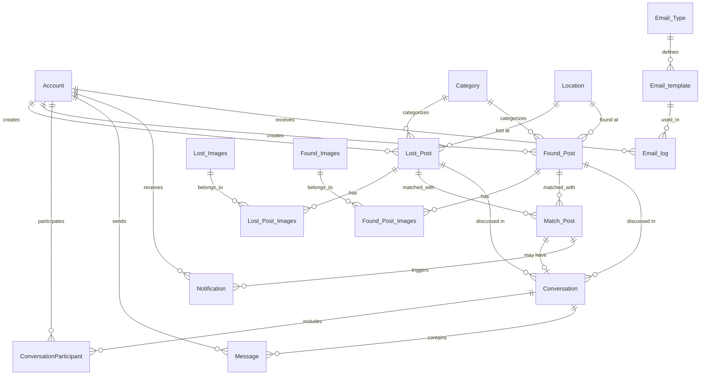

# Database Schema Documentation
## Lost & Found Platform

> [!NOTE]
> This document provides a comprehensive overview of the database schema for the Lost & Found Platform. All table names use PascalCase with quotes in PostgreSQL.

---

## Table of Contents
1. [Account Management](#account-management)
2. [Post Management](#post-management)
3. [Matching System](#matching-system)
4. [Chat System](#chat-system)
5. [Notification System](#notification-system)
6. [Email System](#email-system)
7. [OTP Verification](#otp-verification)
8. [Entity Relationship Overview](#entity-relationship-overview)

---

## Account Management

### Account
**Purpose**: Stores user account information including authentication credentials and profile data.

| Column | Type | Constraints | Description |
|--------|------|-------------|-------------|
| `account_id` | INTEGER | PRIMARY KEY, AUTO INCREMENT | Unique identifier for each account |
| `email` | VARCHAR | NOT NULL, UNIQUE | User's email address (used for login) |
| `password` | VARCHAR | NOT NULL | Hashed password |
| `role` | VARCHAR | NOT NULL, DEFAULT 'Student' | User role: 'Student' or 'Admin' |
| `user_name` | VARCHAR | - | Display name |
| `avatar` | VARCHAR | - | URL to profile picture |
| `phone_number` | VARCHAR | - | Contact number |
| `address` | VARCHAR | - | User's address |
| `created_at` | TIMESTAMP | DEFAULT CURRENT_TIMESTAMP | Account creation timestamp |

**Indexes**: 
- Primary key on `account_id`
- Unique index on `email`

---

## Post Management

### Category
**Purpose**: Categorizes lost and found items.

| Column | Type | Constraints | Description |
|--------|------|-------------|-------------|
| `category_id` | INTEGER | PRIMARY KEY, AUTO INCREMENT | Unique identifier |
| `name` | VARCHAR | NOT NULL | Category name (e.g., "Electronics", "Documents") |
| `type` | VARCHAR | NOT NULL, CHECK | Type: 'Lost' or 'Found' |
| `created_at` | TIMESTAMP | DEFAULT CURRENT_TIMESTAMP | Creation timestamp |
| `updated_at` | TIMESTAMP | DEFAULT CURRENT_TIMESTAMP | Last update timestamp |

### Location
**Purpose**: Stores location information for where items were lost or found.

| Column | Type | Constraints | Description |
|--------|------|-------------|-------------|
| `location_id` | INTEGER | PRIMARY KEY, AUTO INCREMENT | Unique identifier |
| `address` | VARCHAR | NOT NULL | General address |
| `building` | VARCHAR | - | Building name/number |
| `room` | VARCHAR | NOT NULL | Room number or specific location |

### Lost_Post
**Purpose**: Posts created by users who have lost items.

| Column | Type | Constraints | Description |
|--------|------|-------------|-------------|
| `lost_post_id` | INTEGER | PRIMARY KEY, AUTO INCREMENT | Unique identifier |
| `account_id` | INTEGER | NOT NULL, FK → Account | Post creator |
| `post_title` | VARCHAR | NOT NULL | Title of the post |
| `item_name` | VARCHAR | - | Name of the lost item |
| `description` | TEXT | - | Detailed description |
| `category_id` | INTEGER | FK → Category | Item category |
| `location_id` | INTEGER | FK → Location | Where item was lost |
| `status` | ENUM | DEFAULT 'Pending' | Post status: 'Pending', 'Approved', 'Rejected' |
| `views` | INTEGER | DEFAULT 0, CHECK ≥ 0 | Number of views |
| `created_at` | TIMESTAMP | DEFAULT CURRENT_TIMESTAMP | Creation timestamp |
| `updated_at` | TIMESTAMP | DEFAULT CURRENT_TIMESTAMP | Last update timestamp |
| `approved_at` | TIMESTAMP | - | Admin approval timestamp |
| `last_scanned_at` | TIMESTAMP | DEFAULT CURRENT_TIMESTAMP | Last AI scan timestamp |
| `deleted_at` | TIMESTAMP | - | Soft delete timestamp |

### Found_Post
**Purpose**: Posts created by users who have found items.

| Column | Type | Constraints | Description |
|--------|------|-------------|-------------|
| `found_post_id` | INTEGER | PRIMARY KEY, AUTO INCREMENT | Unique identifier |
| `account_id` | INTEGER | NOT NULL, FK → Account | Post creator |
| `post_title` | VARCHAR | NOT NULL | Title of the post |
| `item_name` | VARCHAR | - | Name of the found item |
| `description` | TEXT | - | Detailed description |
| `category_id` | INTEGER | FK → Category | Item category |
| `location_id` | INTEGER | FK → Location | Where item was found |
| `status` | ENUM | DEFAULT 'Pending' | Post status: 'Pending', 'Approved', 'Rejected' |
| `views` | INTEGER | DEFAULT 0, CHECK ≥ 0 | Number of views |
| `created_at` | TIMESTAMP | DEFAULT CURRENT_TIMESTAMP | Creation timestamp |
| `updated_at` | TIMESTAMP | DEFAULT CURRENT_TIMESTAMP | Last update timestamp |
| `approved_at` | TIMESTAMP | - | Admin approval timestamp |
| `last_scanned_at` | TIMESTAMP | DEFAULT CURRENT_TIMESTAMP | Last AI scan timestamp |
| `deleted_at` | TIMESTAMP | - | Soft delete timestamp |

### Lost_Images
**Purpose**: Stores images for lost item posts.

| Column | Type | Constraints | Description |
|--------|------|-------------|-------------|
| `lost_img_id` | INTEGER | PRIMARY KEY, AUTO INCREMENT | Unique identifier |
| `link_picture` | VARCHAR | NOT NULL | URL to image |
| `created_at` | TIMESTAMP | DEFAULT CURRENT_TIMESTAMP | Upload timestamp |
| `updated_at` | TIMESTAMP | DEFAULT CURRENT_TIMESTAMP | Last update timestamp |
| `deleted_at` | TIMESTAMP | - | Soft delete timestamp |

### Found_Images
**Purpose**: Stores images for found item posts.

| Column | Type | Constraints | Description |
|--------|------|-------------|-------------|
| `found_img_id` | INTEGER | PRIMARY KEY, AUTO INCREMENT | Unique identifier |
| `link_picture` | VARCHAR | NOT NULL | URL to image |
| `created_at` | TIMESTAMP | DEFAULT CURRENT_TIMESTAMP | Upload timestamp |
| `updated_at` | TIMESTAMP | DEFAULT CURRENT_TIMESTAMP | Last update timestamp |
| `deleted_at` | TIMESTAMP | - | Soft delete timestamp |

### Lost_Post_Images
**Purpose**: Junction table linking lost posts to their images (many-to-many).

| Column | Type | Constraints | Description |
|--------|------|-------------|-------------|
| `lost_post_id` | INTEGER | PRIMARY KEY, FK → Lost_Post | Lost post reference |
| `lost_img_id` | INTEGER | PRIMARY KEY, FK → Lost_Images | Image reference |

**Composite Primary Key**: (`lost_post_id`, `lost_img_id`)

### Found_Post_Images
**Purpose**: Junction table linking found posts to their images (many-to-many).

| Column | Type | Constraints | Description |
|--------|------|-------------|-------------|
| `found_post_id` | INTEGER | PRIMARY KEY, FK → Found_Post | Found post reference |
| `found_img_id` | INTEGER | PRIMARY KEY, FK → Found_Images | Image reference |

**Composite Primary Key**: (`found_post_id`, `found_img_id`)

---

## Matching System

### Match_Post
**Purpose**: Stores AI-generated matches between lost and found posts.

| Column | Type | Constraints | Description |
|--------|------|-------------|-------------|
| `match_id` | INTEGER | PRIMARY KEY, AUTO INCREMENT | Unique identifier |
| `lost_post_id` | INTEGER | NOT NULL, FK → Lost_Post | Reference to lost post |
| `found_post_id` | INTEGER | NOT NULL, FK → Found_Post | Reference to found post |
| `confidence_score` | NUMERIC | NOT NULL | AI confidence score (0.0 - 1.0) |
| `matched_at` | TIMESTAMP | DEFAULT CURRENT_TIMESTAMP | Match creation timestamp |

**Match Display Logic**:
- 🟢 **High Match** (≥80%): `confidence_score >= 0.8`
- 🟡 **Regular Match** (60-79%): `confidence_score >= 0.6`
- ⚪ **Hidden Match** (45-59%): `confidence_score >= 0.45`
- 🔴 **Invalid** (<45%): `confidence_score < 0.45`

---

## Chat System

### Conversation
**Purpose**: Represents a chat conversation between users, optionally linked to a match.

| Column | Type | Constraints | Description |
|--------|------|-------------|-------------|
| `conversation_id` | INTEGER | PRIMARY KEY, AUTO INCREMENT | Unique identifier |
| `match_id` | INTEGER | UNIQUE, FK → Match_Post | Optional match reference |
| `lost_post_id` | INTEGER | FK → Lost_Post | Lost post reference |
| `found_post_id` | INTEGER | FK → Found_Post | Found post reference |
| `created_at` | TIMESTAMP | DEFAULT CURRENT_TIMESTAMP | Creation timestamp |
| `updated_at` | TIMESTAMP | DEFAULT CURRENT_TIMESTAMP | Last update timestamp |

### ConversationParticipant
**Purpose**: Links users to conversations they participate in.

| Column | Type | Constraints | Description |
|--------|------|-------------|-------------|
| `participant_id` | INTEGER | PRIMARY KEY, AUTO INCREMENT | Unique identifier |
| `conversation_id` | INTEGER | NOT NULL, FK → Conversation | Conversation reference |
| `account_id` | INTEGER | NOT NULL, FK → Account | User reference |
| `joined_at` | TIMESTAMP | DEFAULT CURRENT_TIMESTAMP | Join timestamp |
| `last_read_at` | TIMESTAMP | - | Last message read timestamp |
| `is_deleted` | BOOLEAN | DEFAULT false | Soft delete flag |

### Message
**Purpose**: Stores individual chat messages.

| Column | Type | Constraints | Description |
|--------|------|-------------|-------------|
| `message_id` | INTEGER | PRIMARY KEY, AUTO INCREMENT | Unique identifier |
| `conversation_id` | INTEGER | NOT NULL, FK → Conversation | Conversation reference |
| `sender_id` | INTEGER | NOT NULL, FK → Account | Message sender |
| `message` | TEXT | NOT NULL, CHECK length > 0 | Message content |
| `is_read` | BOOLEAN | DEFAULT false | Read status |
| `created_at` | TIMESTAMP | DEFAULT CURRENT_TIMESTAMP | Send timestamp |
| `updated_at` | TIMESTAMP | DEFAULT CURRENT_TIMESTAMP | Last edit timestamp |
| `deleted_at` | TIMESTAMP | - | Soft delete timestamp |

---

## Notification System

### Notification
**Purpose**: Stores user notifications for various events.

| Column | Type | Constraints | Description |
|--------|------|-------------|-------------|
| `notification_id` | INTEGER | PRIMARY KEY, AUTO INCREMENT | Unique identifier |
| `account_id` | INTEGER | FK → Account | Recipient user |
| `match_id` | INTEGER | FK → Match_Post | Optional match reference |
| `type` | VARCHAR | NOT NULL, CHECK | Notification type |
| `message` | VARCHAR | - | Notification message |
| `link` | VARCHAR | NOT NULL | URL to related resource |
| `is_read` | BOOLEAN | DEFAULT false | Read status |
| `created_at` | TIMESTAMP | DEFAULT CURRENT_TIMESTAMP | Creation timestamp |

**Notification Types**:
- `match`: New AI match found
- `message`: New chat message received
- `post_pending`: Post submitted for review
- `post_approved`: Post approved by admin
- `post_rejected`: Post rejected by admin

---

## Email System

### Email_Type
**Purpose**: Defines types of emails sent by the system.

| Column | Type | Constraints | Description |
|--------|------|-------------|-------------|
| `email_type_id` | INTEGER | PRIMARY KEY, AUTO INCREMENT | Unique identifier |
| `name` | VARCHAR | - | Email type name |
| `code` | VARCHAR | - | Email type code |
| `created_at` | TIMESTAMP | DEFAULT CURRENT_TIMESTAMP | Creation timestamp |

### Email_template
**Purpose**: Stores email templates for different email types.

| Column | Type | Constraints | Description |
|--------|------|-------------|-------------|
| `email_template_id` | INTEGER | PRIMARY KEY, AUTO INCREMENT | Unique identifier |
| `email_type_id` | INTEGER | FK → Email_Type | Email type reference |
| `title` | VARCHAR | - | Email subject |
| `body` | TEXT | - | Email body template |
| `status` | INTEGER | - | Template status |
| `created_at` | TIMESTAMP | DEFAULT CURRENT_TIMESTAMP | Creation timestamp |

### Email_log
**Purpose**: Logs all emails sent by the system.

| Column | Type | Constraints | Description |
|--------|------|-------------|-------------|
| `email_log_id` | INTEGER | PRIMARY KEY, AUTO INCREMENT | Unique identifier |
| `account_id` | INTEGER | NOT NULL, FK → Account | Recipient user |
| `email_template_id` | INTEGER | NOT NULL, FK → Email_template | Template used |
| `email_content` | TEXT | - | Actual email content sent |
| `sent_at` | TIMESTAMP | DEFAULT CURRENT_TIMESTAMP | Send timestamp |

---

## OTP Verification

### otp_verifications
**Purpose**: Stores one-time passwords for email verification and password reset.

| Column | Type | Constraints | Description |
|--------|------|-------------|-------------|
| `id` | UUID | PRIMARY KEY, DEFAULT gen_random_uuid() | Unique identifier |
| `email` | VARCHAR | NOT NULL | Email address |
| `otp_code` | VARCHAR | NOT NULL | One-time password code |
| `payload` | JSONB | NOT NULL, DEFAULT '{}' | Additional data |
| `expires_at` | TIMESTAMP WITH TIME ZONE | NOT NULL | Expiration timestamp |
| `is_used` | BOOLEAN | DEFAULT false | Usage flag |
| `created_at` | TIMESTAMP WITH TIME ZONE | DEFAULT now() | Creation timestamp |

---

## Entity Relationship Overview



---

## Key Relationships

### Post Management Flow
1. User creates a `Lost_Post` or `Found_Post`
2. Admin reviews and approves/rejects (updates `status`)
3. Upon approval, AI matching system scans for matches
4. Matches are stored in `Match_Post` with confidence scores

### Chat Flow
1. Users can create `Conversation` from a `Match_Post` or directly from posts
2. `ConversationParticipant` links users to conversations
3. `Message` records are created when users chat
4. `Notification` alerts users of new messages

### Notification Flow
1. System events trigger `Notification` creation
2. Types include: match found, message received, post status changes
3. Users can mark notifications as read (`is_read = true`)

---

## Important Notes

> [!IMPORTANT]
> **Case Sensitivity**: All table names in PostgreSQL are case-sensitive and must be quoted when used in queries:
> ```sql
> -- Correct
> SELECT * FROM "Match_Post";
> 
> -- Incorrect (will look for "match_post")
> SELECT * FROM Match_Post;
> ```

> [!WARNING]
> **Soft Deletes**: Tables with `deleted_at` columns use soft delete pattern. Always filter by `deleted_at IS NULL` in queries to exclude deleted records.

> [!TIP]
> **Performance**: Consider adding indexes on frequently queried columns:
> - `Lost_Post.status`, `Found_Post.status`
> - `Match_Post.confidence_score`
> - `Message.conversation_id`, `Message.created_at`
> - `Notification.account_id`, `Notification.is_read`

---

## Database Statistics

| Category | Table Count |
|----------|-------------|
| Account Management | 1 |
| Post Management | 8 |
| Matching System | 1 |
| Chat System | 3 |
| Notification System | 1 |
| Email System | 3 |
| OTP Verification | 1 |
| **Total** | **18** |

---

*Last Updated: 2025-12-16*
